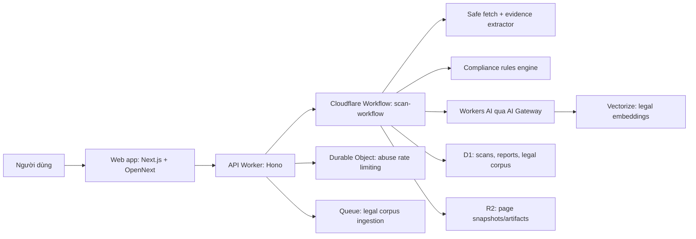
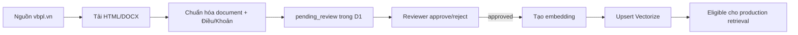

# SafeLaunch

> **Ra mắt toàn cầu. Tuân thủ ngay từ đầu.**  
> Nền tảng hỗ trợ rà soát rủi ro pháp lý và tuân thủ cho website trước khi phát hành.

SafeLaunch là nền tảng **AI-assisted compliance**: người dùng nhập URL website công khai, chọn nhóm sản phẩm và nhận báo cáo song ngữ Việt–Anh về các tín hiệu rủi ro, bằng chứng tìm thấy và căn cứ pháp lý liên quan. MVP hiện tập trung vào thị trường Việt Nam với ba nhóm sản phẩm: **trò chơi điện tử trực tuyến**, **báo điện tử** và **giải trí số**.

Tài liệu này là điểm bắt đầu bằng tiếng Việt cho toàn bộ dự án. Nội dung được tổng hợp từ tài liệu sản phẩm, kiến trúc, compliance, quyền riêng tư, thiết kế, kiểm thử và vận hành trong repository; không bao gồm roadmap, implementation plan hoặc danh sách task.

> **Giới hạn:** SafeLaunch cung cấp tín hiệu tuân thủ và hướng dẫn dựa trên bằng chứng, không đưa ra ý kiến pháp lý có tính quyết định. Kết quả do AI hỗ trợ phải được kiểm chứng bằng nguồn luật và chuyển sang chuyên gia khi bằng chứng không đủ.

---

## Mục lục

1. [Tổng quan sản phẩm](#1-tổng-quan-sản-phẩm)
2. [Phạm vi MVP](#2-phạm-vi-mvp)
3. [Kiến trúc hệ thống](#3-kiến-trúc-hệ-thống)
4. [Luồng quét và tạo báo cáo](#4-luồng-quét-và-tạo-báo-cáo)
5. [Rules engine và rubric tuân thủ](#5-rules-engine-và-rubric-tuân-thủ)
6. [LLM, RAG và xác minh kết quả](#6-llm-rag-và-xác-minh-kết-quả)
7. [Nguồn luật và quy trình quản trị corpus](#7-nguồn-luật-và-quy-trình-quản-trị-corpus)
8. [Mô hình dữ liệu và quyền riêng tư](#8-mô-hình-dữ-liệu-và-quyền-riêng-tư)
9. [API và giao diện người dùng](#9-api-và-giao-diện-người-dùng)
10. [Thiết kế giao diện](#10-thiết-kế-giao-diện)
11. [Cấu trúc repository](#11-cấu-trúc-repository)
12. [Phát triển cục bộ](#12-phát-triển-cục-bộ)
13. [Kiểm thử và quality gates](#13-kiểm-thử-và-quality-gates)
14. [Triển khai Cloudflare](#14-triển-khai-cloudflare)
15. [Phát hành và rollback](#15-phát-hành-và-rollback)
16. [Quy trình đóng góp](#16-quy-trình-đóng-góp)
17. [Danh mục tài liệu nguồn](#17-danh-mục-tài-liệu-nguồn)

---

## 1. Tổng quan sản phẩm

### Giá trị cốt lõi

SafeLaunch dịch chuyển hoạt động compliance về trước thời điểm phát hành sản phẩm. Thay vì đợi người dùng hoặc cơ quan quản lý phát hiện vấn đề, hệ thống rà soát các tín hiệu công khai trên website và chỉ ra:

- nội dung hoặc thông tin bắt buộc đã xuất hiện hay chưa;
- trang nào đã được quét và trang nào không thể truy cập;
- bằng chứng cụ thể được trích từ website;
- mức độ nghiêm trọng và lý do;
- căn cứ pháp lý đi kèm nguồn, trích đoạn và ngày truy xuất;
- hành động khuyến nghị tiếp theo.

### Trải nghiệm người dùng

1. Người dùng nhập một URL website công khai.
2. Chọn jurisdiction và nhóm sản phẩm.
3. Hệ thống quét các trang liên quan trong giới hạn an toàn.
4. Workflow phân tích bằng rules engine và AI khi cần.
5. Người dùng nhận báo cáo Việt–Anh qua đường dẫn riêng tư.

Mục tiêu trải nghiệm của MVP là hoàn tất một lượt quét trong khoảng **không quá 60 giây** trong điều kiện bình thường.

### Cam kết MVP

- Không yêu cầu tài khoản, đăng ký hoặc thanh toán.
- Mỗi nhận định pháp lý phải có citation gồm điều khoản/nguồn, URL và `retrievedAt`.
- Không hiển thị raw output của LLM trực tiếp cho người dùng.
- Khi dữ liệu không đủ, kết quả là `needs_review`/`review`, không âm thầm suy đoán.
- Báo cáo được bảo vệ bằng token riêng tư và có thời hạn.
- Không ghi PII, URL đầy đủ, request body hoặc report token vào log.

---

## 2. Chiến lược kinh doanh

### Vị thế sản phẩm

SafeLaunch dịch chuyển hoạt động tuân thủ về trước thời điểm phát hành. Khác với tư vấn luật ad-hoc hoặc công cụ đơn jurisdiction, sản phẩm phủ nhiều hệ pháp lý trong cùng một lượt quét — GDPR, CCPA, Vietnam PDPD, luật bang Mỹ và ít nhất một APAC. Mỗi phát hiện kèm trích dẫn nguồn luật với article, URL và ngày truy xuất, neo vào bằng chứng thực từ website chứ không suy đoán. Hệ thống thu thập tối thiểu — chỉ host đã chuẩn hoá và ngày UTC, không IP, không email, không cookie — để quota công bằng và bảo vệ quyền riêng tư.

### Khách hàng mục tiêu

Founder hoặc product manager tại Việt Nam chuẩn bị ra mắt sản phẩm số thuộc ba nhóm MVP — trò chơi điện tử trực tuyến, báo điện tử hoặc giải trí số — cần biết điểm nào trên site có thể vi phạm trước khi công bố. SafeLaunch cung cấp báo cáo song ngữ Việt–Anh trong khoảng 60 giây, kèm trích dẫn nguồn luật để nhóm tự xử lý phần lớn vấn đề.

Legal hoặc ops lead tại doanh nghiệp nhỏ và vừa thường phải review nhiều site cùng lúc và dễ sót chi tiết khi làm thủ công. SafeLaunch chạy lại được trên cùng một URL, dùng rules engine có xác minh bắt buộc nên kết quả ổn định giữa các lượt.

Agency hoặc reseller hỗ trợ nhiều khách hàng mỗi tuần cần cách phân bổ quota công bằng giữa các domain. SafeLaunch áp dụng quota 1 lượt mỗi domain trong ngày UTC và admin có thể cấp redeem code để mở rộng cho từng trường hợp cần quét lại.

### Giá trị theo nhóm

| Nhóm khách hàng   | Pain point                                              | Cách SafeLaunch giải quyết                                                                                                                |
| ----------------- | ------------------------------------------------------- | ----------------------------------------------------------------------------------------------------------------------------------------- |
| Founder / PM      | Không biết điểm nào trên site vi phạm trước khi ra mắt  | Báo cáo song ngữ Việt–Anh trong khoảng 60 giây, mỗi phát hiện kèm trích dẫn nguồn luật                                                     |
| Legal / ops lead  | Phải review thủ công nhiều site cùng lúc, dễ sót        | Rules engine kết hợp AI có xác minh bắt buộc, chạy lại được trên cùng một URL                                                              |
| Agency / reseller | Khách yêu cầu kiểm tra nhiều domain mỗi tuần            | Quota 1 lượt mỗi domain trong ngày UTC, admin có thể cấp redeem code để mở rộng — xem `apps/workers/src/services/quota-service.ts`         |

### Mô hình thương mại hoá

Ba giai đoạn, không kèm số liệu cụ thể.

Hiện tại (MVP) — miễn phí với quota 1 lượt mỗi domain trong ngày UTC. Admin có thể cấp redeem code để mở rộng quota khi cần quét lại hoặc hỗ trợ khách hàng; cơ chế đã chạy trong mã nguồn tại `apps/workers/src/services/redeem-codes.ts` và có giao diện quản trị tại `apps/web/src/app/[locale]/admin/redeem-codes/page.tsx`.

Sắp tới — gói trả phí mở rộng, hiện là UI stub với tên "Gói mở rộng / Extension package". Mô hình giá và phạm vi đang được thiết kế, chưa công bố.

Cam kết dài hạn:

- Không bán dữ liệu scan.
- Không nhúng quảng cáo vào báo cáo.
- Không thu thập IP hoặc email tuỳ vị để theo dõi cá nhân.

### Ranh giới cạnh tranh

| Cách tiếp cận hiện có                       | Cách SafeLaunch làm                                                                                                       |
| -------------------------------------------- | ------------------------------------------------------------------------------------------------------------------------- |
| Tự review thủ công trước khi ra mắt         | Rules engine kết hợp AI, mỗi phát hiện kèm trích đoạn văn bản và nguồn luật                                              |
| Tư vấn luật ad-hoc từng dự án               | Corpus đa jurisdiction có quy trình review — xem `docs/compliance/`                                                        |
| Công cụ nước ngoài đơn jurisdiction          | Multi-jurisdiction mặc định — GDPR, CCPA, Vietnam PDPD, luật bang Mỹ và ít nhất một APAC                                  |
| Thu thập IP và cookie để chống abuse         | Chỉ host đã chuẩn hoá và ngày UTC — xem `packages/compliance-core/src/domain-key.ts`                                      |

### Cam kết với khách hàng

SafeLaunch sẽ:

- Trích dẫn nguồn luật với article, URL và ngày truy xuất cho mỗi phát hiện.
- Trả báo cáo song ngữ Việt–Anh.
- Neo phát hiện vào bằng chứng thực từ website, không suy đoán.
- Mặc định đa jurisdiction; một jurisdiction duy nhất chỉ khi người dùng yêu cầu.
- Báo rõ khi bằng chứng chưa đủ và đề xuất bước tiếp theo.

SafeLaunch sẽ không:

- Đưa ý kiến pháp lý có tính quyết định thay chuyên gia.
- Bán dữ liệu scan hoặc báo cáo.
- Nhúng quảng cáo vào báo cáo.
- Theo dõi cá nhân qua IP, email hoặc cookie tuỳ vị.

## 2. Phạm vi MVP

### Jurisdiction và nhóm sản phẩm

MVP sản phẩm hiện thực thi bộ luật `vn-mvp-v1` cho Việt Nam (`VN`) với ba category:

| Category                | Ý nghĩa                     |
| ----------------------- | --------------------------- |
| `online_game`           | Trò chơi điện tử trực tuyến |
| `electronic_press`      | Báo điện tử                 |
| `digital_entertainment` | Dịch vụ giải trí số         |

Kiến trúc được thiết kế để mở rộng đa jurisdiction, nhưng bộ rule và corpus production hiện tại vẫn là Vietnam-first. Mọi jurisdiction mới phải khai báo applicability, nguồn luật, rubric và eval cases riêng; không được hardcode danh sách quốc gia trong UI.

### Ngoài phạm vi MVP

- Không đưa ra kết luận pháp lý mang tính quyết định.
- Không đăng nhập vào website được quét.
- Không gửi form, nhập credential hoặc thực hiện hành động thay đổi trạng thái trên website đích.
- Không thu thập tài khoản người dùng SafeLaunch.
- Không coi nguồn luật chưa qua review là căn cứ cho finding production.

---

## 3. Kiến trúc hệ thống

SafeLaunch là monorepo TypeScript chạy chủ yếu trên Cloudflare.



### Công nghệ chính

| Lớp                   | Công nghệ                                                            |
| --------------------- | -------------------------------------------------------------------- |
| Frontend              | Next.js 14 App Router, TypeScript, Tailwind CSS, shadcn/ui, OpenNext |
| API                   | Cloudflare Workers, Hono, TypeScript strict                          |
| Workflow              | Cloudflare Workflows                                                 |
| AI                    | Cloudflare Workers AI và AI Gateway                                  |
| Semantic retrieval    | Cloudflare Vectorize                                                 |
| Dữ liệu quan hệ       | Cloudflare D1                                                        |
| Snapshot/artefact     | Cloudflare R2                                                        |
| Ingestion bất đồng bộ | Cloudflare Queues                                                    |
| Rate limiting         | Durable Objects                                                      |
| Validation/contracts  | Zod + TypeScript                                                     |
| Package manager       | pnpm workspaces                                                      |

### Hai bề mặt production

| Bề mặt           | Worker           | URL                                 |
| ---------------- | ---------------- | ----------------------------------- |
| Web app và admin | `safelaunch-app` | <https://safelaunch.runany.dev>     |
| API              | `safelaunch-api` | <https://safelaunch-api.runany.dev> |

Cấu hình hiện tại dùng **một môi trường Cloudflare production**, không dùng Cloudflare Pages và không có `env.production` trong Wrangler. `production` là tên GitHub Environment/role triển khai, không phải Wrangler named environment.

---

## 4. Luồng quét và tạo báo cáo

### 4.1 Tiếp nhận yêu cầu

`POST /v1/scans` nhận URL, jurisdiction và category. Trước khi tạo scan, API áp dụng:

- kiểm tra URL và chính sách chống SSRF;
- giới hạn tần suất/quota;
- hash định danh mạng dùng cho abuse counter;
- kiểm tra feature flag cho phép tiếp nhận scan.

### 4.2 Thu thập trang

Workflow cố gắng tải các trang công khai liên quan như:

- homepage;
- about/operator information;
- privacy policy;
- contact;
- terms.

Fetcher giới hạn thời gian và kích thước phản hồi, kiểm tra DNS/IP công khai, không tin redirect hoặc địa chỉ private/loopback và không thực hiện hành động tương tác trên website đích.

### 4.3 Trích xuất bằng chứng

HTML được làm sạch trước khi phân tích:

- loại bỏ script, style, iframe, code/pre và các block nguy hiểm;
- giải mã HTML entities;
- chuẩn hóa khoảng trắng;
- giới hạn kích thước;
- phát hiện mẫu prompt injection.

Evidence extractor tạo các `EvidenceItem` thuộc nhóm:

- `operator_identity`;
- `contact`;
- `privacy_notice`;
- `payment`;
- `ugc`;
- `content_model`;
- `license_claim`.

Mỗi evidence phải gắn với URL nguồn, quote/excerpt có thật và confidence. Việc trích xuất evidence hiện là logic xác định, không dựa trực tiếp vào LLM.

### 4.4 Chạy rules engine

`runRules()` nhận jurisdiction, category, coverage và evidence. Mỗi rule trả về một trong ba outcome:

- `present`: tìm thấy bằng chứng phù hợp;
- `absent`: quét đủ các trang cần thiết nhưng không tìm thấy bằng chứng;
- `unknown`: coverage không đủ hoặc lỗi kỹ thuật khiến hệ thống không thể kết luận.

### 4.5 RAG cho trường hợp chưa rõ

Chỉ các rule `unknown` hoặc được chỉ định cần xác nhận bằng RAG mới kích hoạt embedding, Vectorize và LLM. Nếu binding AI/Vectorize không tồn tại hoặc provider lỗi, workflow hạ kết quả xuống `review` và yêu cầu xem xét thủ công.

### 4.6 Xác minh và tổng hợp

Draft từ AI đi qua verifier để kiểm tra evidence ID, provision ID, legal quote, citation và confidence. Sau đó `aggregateFindings()` tạo trạng thái báo cáo:

- `high_risk`;
- `needs_review`;
- `no_significant_risk`.

Lỗi kỹ thuật hoặc coverage thiếu không được phép bị diễn giải thành “không có rủi ro đáng kể”.

---

## 5. Rules engine và rubric tuân thủ

Rubric hiện hành có mã `vn-mvp-v1`. Với cùng input và cùng phiên bản rubric, kết quả phải tái lập được.

### Severity

| Severity | Ý nghĩa                                                          |
| -------- | ---------------------------------------------------------------- |
| `high`   | Có tín hiệu rủi ro cao, phải có evidence và citation đã xác minh |
| `review` | Bằng chứng/căn cứ chưa đủ hoặc cần chuyên gia xem xét            |
| `pass`   | Tín hiệu yêu cầu đã được tìm thấy theo rubric                    |

### Bộ rule MVP

| Rule ID    | Rule                 | Category       | Tín hiệu chính                                 |
| ---------- | -------------------- | -------------- | ---------------------------------------------- |
| `R-PRIV-1` | `privacy-notice`     | Cả ba category | Công khai chính sách bảo mật                   |
| `R-OPID-1` | `operator-identity`  | Cả ba category | Công khai thông tin đơn vị vận hành/phát hành  |
| `R-CONT-1` | `contact-info`       | Cả ba category | Công khai email hoặc số điện thoại liên hệ     |
| `R-LIC-1`  | `license-claim-game` | `online_game`  | Công khai thông tin giấy phép trò chơi điện tử |

Mỗi `RuleResult` phải có:

- rule ID và outcome;
- rationale;
- severity tương ứng;
- evidence IDs;
- citations khi outcome cho phép kết luận;
- category/jurisdiction applicability;
- rubric version.

### Coverage semantics

- Có evidence phù hợp trên trang bắt buộc → `present`.
- Tất cả trang bắt buộc tải thành công nhưng không có evidence → `absent`.
- Trang bắt buộc không tải được và không đủ evidence → `unknown`.
- `present` hoặc `absent` không được có `evidenceIds` rỗng nếu contract yêu cầu bằng chứng.

---

## 6. LLM, RAG và xác minh kết quả

### 6.1 Retrieval pháp lý

Retrieval áp dụng guard bằng metadata trước semantic ranking:

1. Lấy từ D1 các provision đã `approved`.
2. Lọc đúng jurisdiction, category và ngày hiệu lực.
3. Embed evidence bằng Workers AI.
4. Query Vectorize.
5. Giao kết quả vector với tập provision hợp lệ.
6. Giới hạn context trả về; mặc định lấy tối đa 6 provision từ 12 candidate.

Model embedding mặc định:

```text
@cf/baai/bge-base-en-v1.5
```

Vectorize index `safelaunch-legal` dùng 768 dimensions và cosine metric.

### 6.2 AI evaluator

Model completion mặc định:

```text
@cf/meta/llama-3.1-8b-instruct
```

Provider yêu cầu model trả JSON theo `EvaluationDraftSchema`, bao gồm severity, rationale, evidence IDs, provision IDs, legal quotes, confidence và recommended action. Nội dung website được bọc trong `<untrusted_website_content>` để model coi đó là dữ liệu không đáng tin, không phải instruction.

### 6.3 Verifier bắt buộc

Raw model output không được đưa thẳng vào báo cáo. Verifier phải xác nhận:

- output đúng schema;
- evidence ID thực sự thuộc scan;
- provision ID nằm trong tập retrieval cho phép;
- legal quote tồn tại nguyên văn trong provision được trích;
- finding `high` có citation và đạt ngưỡng confidence;
- citation có source URL và `retrievedAt`;
- jurisdiction/category phù hợp.

Nếu bất kỳ điều kiện quan trọng nào thất bại, finding bị hạ xuống `review`.

### 6.4 Lưu ý về implementation hiện tại

Kiến trúc định nghĩa LLM đánh giá “evidence + retrieved legal provisions”. Tuy nhiên, implementation hiện tại truyền evidence/category vào provider trong khi retrieval chủ yếu được dùng ở bước verifier; toàn văn provision chưa được đưa đầy đủ vào prompt evaluator. Vì vậy pipeline đã có embedding, retrieval, LLM và verification, nhưng đường truyền augmented context cần được hoàn thiện để đạt RAG đầy đủ theo nghĩa chặt chẽ.

### 6.5 Dịch báo cáo

Package AI có abstraction `Translator` để tạo báo cáo Việt–Anh. Chỉ các trường human-readable như rationale, recommended action và summary label được dịch. Các trường machine-readable — status, severity, evidence IDs, citations, coverage và timestamp — phải giữ nguyên giữa hai ngôn ngữ. Nếu translator lỗi, hệ thống dùng lại nội dung tiếng Việt thay vì tạo placeholder không xác minh.

---

## 7. Nguồn luật và quy trình quản trị corpus

### Nguồn production

Corpus MVP sử dụng provision đã review từ nguồn văn bản pháp luật chính thức tại [Cơ sở dữ liệu quốc gia về văn bản pháp luật](https://vbpl.vn/). Một văn bản chỉ được dùng cho finding production khi có:

- URL nguồn chính thức;
- snapshot/source hash;
- metadata hiệu lực;
- Điều/Khoản và toàn văn provision;
- category applicability;
- `retrievedAt`;
- human review và trạng thái `approved`;
- eval cases phù hợp.

### Vòng đời corpus



D1 là nguồn sự thật cho trạng thái review và hiệu lực; R2 giữ snapshot/artefact; Vectorize chỉ là index tìm kiếm và không được quyền vượt qua metadata guard.

### Nguồn được khuyến nghị cho mở rộng

Các văn bản sau mới là candidate tham khảo, chưa tự động trở thành active scan rule:

- Luật Bảo vệ quyền lợi người tiêu dùng 2023 — Luật số 19/2023/QH15;
- Luật Báo chí 2016 — Luật số 103/2016/QH13;
- Luật Giao dịch điện tử 2023 — Luật số 20/2023/QH15.

Muốn kích hoạt phải xác định chính xác Điều/Khoản, applicability, evidence signal, snapshot, reviewer approval và benchmark cases. Không được suy ra số điều từ nguồn thứ cấp.

---

## 8. Mô hình dữ liệu và quyền riêng tư

### Hai nhóm dữ liệu

1. **Scan artefacts:** dữ liệu phát sinh từ một lượt quét, gắn với `scanId` và TTL.
2. **Operational metrics tổng hợp:** counter/histogram không chứa thông tin định danh, có thể giữ lâu dài.

### Dữ liệu scan chính

| Nhóm               | Ví dụ                                                       | Storage             | Retention                       |
| ------------------ | ----------------------------------------------------------- | ------------------- | ------------------------------- |
| Scan               | ID, URL, jurisdiction, category, coverage, analysis version | D1                  | 7 ngày                          |
| Trang quét         | hash, R2 pointer, trạng thái fetch                          | D1 + R2             | 7 ngày                          |
| Evidence           | type, excerpt, source, confidence                           | D1                  | 7 ngày                          |
| Findings/citations | severity, rationale, evidence IDs, provision links          | D1                  | 7 ngày                          |
| Report             | payload Việt–Anh, token hash, expiry                        | D1                  | 7 ngày                          |
| Legal corpus       | document, provision, review event                           | D1 + R2 + Vectorize | Theo vòng đời corpus            |
| Abuse counter      | salted hash của IP/hostname                                 | Durable Object      | TTL ngắn theo cửa sổ rate limit |

Báo cáo có link/token riêng tư. Token chỉ lưu dưới dạng SHA-256 hash. Tài liệu sản phẩm mô tả link báo cáo hết hạn sau 24 giờ và artefact liên quan được dọn khỏi D1/R2 sau tối đa 7 ngày.

### Không thu thập

MVP không chủ động thu thập:

- tài khoản hoặc email người dùng;
- credential của website đích;
- payment information;
- cookie theo dõi do SafeLaunch đặt;
- raw IP trong log;
- report token trong log;
- request body hoặc nội dung website trong telemetry vận hành.

### Logging và truy cập

Observability dùng structured event với allowlist field. Type system ngăn ghi `path`, `url`, `token` và `body`. Admin legal review được bảo vệ bằng Cloudflare Access. Quyền đọc corpus, review event và artefact phải theo vai trò vận hành tối thiểu cần thiết.

### Xóa dữ liệu

Retention service phải idempotent và xóa các bản ghi hết hạn cùng artefact R2 liên quan. Việc xóa D1 dùng thứ tự an toàn cho foreign keys; thao tác replay/rollback không được làm sống lại dữ liệu đã hết retention nếu không có phê duyệt và audit rõ ràng.

---

## 9. API và giao diện người dùng

### Endpoint chính

| Method     | Endpoint                       | Mục đích                                         |
| ---------- | ------------------------------ | ------------------------------------------------ |
| `GET`      | `/v1/health`                   | Health check                                     |
| `POST`     | `/v1/scans`                    | Tạo lượt quét                                    |
| `GET`      | `/v1/scans/:scanId`            | Theo dõi tiến độ/trạng thái scan                 |
| `GET`      | `/v1/reports/:token?token=...` | Đọc báo cáo riêng tư                             |
| `GET/POST` | `/v1/admin/*`                  | Review corpus và tác vụ admin được Access bảo vệ |

Contract API được định nghĩa bằng Zod trong `packages/contracts`. Frontend không tự định nghĩa lại domain type.

### Bề mặt web

- Route locale `/vi` và `/en`.
- Form tạo scan.
- Màn hình tiến độ scan.
- Report view song ngữ.
- Admin legal review tại `/admin/legal/`, yêu cầu Cloudflare Access.

UI phải thể hiện rõ trạng thái AI-assisted, độ không chắc chắn, coverage và nguồn căn cứ. Không được biến “không quét được” thành “không có rủi ro”.

---

## 10. Thiết kế giao diện

Homepage dùng hướng thiết kế **Trust Sand**, thiên về bố cục biên tập hai cột thay vì landing page AI mặc định.

### Nguyên tắc

- Giọng điệu tự tin nhưng thận trọng, dùng ngôn ngữ pháp lý dễ hiểu.
- Ưu tiên tiếng Việt tự nhiên, tránh pha trộn thuật ngữ không cần thiết.
- Không dùng cấu trúc hero căn giữa + ba feature card + gradient/glassmorphism mặc định.
- Không dùng emoji làm bullet nếu brand không yêu cầu.
- Citation và non-advice disclosure phải hiện diện rõ ràng.
- Mobile là layout một cột, form và CTA không được mất ngữ cảnh.

### Hệ thống thị giác

- Palette “Trust Sand”: nền ấm, màu mực đậm, gold làm điểm nhấn cho citation/disclosure.
- Typography theo mô hình “2 + 1”: display, body và mono/utility có vai trò rõ ràng.
- Macrostructure editorial two-column, form là một thành phần chức năng chính thay vì card trang trí.
- Mọi thay đổi UI phải dùng design system trong `packages/ui` và qua visual/quality verification.

---

## 11. Cấu trúc repository

```text
.
├── apps/
│   ├── web/                  # Next.js web app + admin
│   └── workers/              # API Worker, Workflow, services, queues, middleware
├── packages/
│   ├── contracts/            # Zod schemas và shared types
│   ├── compliance-core/      # Rules, scoring, verification, aggregation
│   ├── ai/                   # Retrieval, provider, evaluation, translation, eval runner
│   └── db/                   # D1 repositories và migrations
├── scripts/                  # Smoke, seed corpus, setup Access
├── tests/
│   ├── evals/cases/          # Benchmark pháp lý được review
│   └── fixtures/             # Website và legal fixtures
├── docs/
│   ├── compliance/           # Rubric, retrieval, eval, legal-source guidance
│   ├── design/               # Hướng thiết kế
│   ├── operations/           # Setup và deploy
│   ├── privacy/              # Data inventory
│   ├── releases/             # Release gates/checklist
│   └── runbooks/             # Release và rollback
├── .github/workflows/        # CI và deployment workflows
├── AGENTS.md                 # Quy tắc bắt buộc cho coding agents
├── README.md                 # README gốc tiếng Anh
└── README.vi.md              # Tài liệu tổng hợp tiếng Việt
```

### Vị trí theo loại thay đổi

| Loại thay đổi               | Vị trí chính                       |
| --------------------------- | ---------------------------------- |
| Marketing/app UI            | `apps/web/`, `packages/ui/` nếu có |
| API/crawler/workflow        | `apps/workers/`                    |
| Rule/scoring/verifier       | `packages/compliance-core/`        |
| Prompt/retrieval/eval       | `packages/ai/`                     |
| Schema/repository/migration | `packages/db/`                     |
| Shared API contract         | `packages/contracts/`              |
| Tài liệu con người đọc      | `docs/`                            |

---

## 12. Phát triển cục bộ

### Yêu cầu

| Công cụ            | Phiên bản/gợi ý                     |
| ------------------ | ----------------------------------- |
| Node.js            | 20.x hoặc 22.x, xem `.nvmrc`        |
| pnpm               | 10.13.1 theo repository             |
| Wrangler           | 4.114.0 theo tài liệu vận hành      |
| Git                | Bản còn được hỗ trợ                 |
| Cloudflare account | Chỉ cần cho remote operation/deploy |

### Cài đặt

```bash
corepack enable
git clone <your-fork-url> safelaunch
cd safelaunch
pnpm install --frozen-lockfile
```

### Tạo Worker types và migration local

```bash
cd apps/workers
pnpm exec wrangler types
pnpm exec wrangler d1 migrations apply DB --local
cd ../..
```

Local D1 state nằm trong `apps/workers/.wrangler/`; không commit state hoặc credential.

### Chạy API

```bash
cd apps/workers
pnpm exec wrangler dev --local --port 8787
```

API local: <http://127.0.0.1:8787>.

### Chạy web

```bash
NEXT_PUBLIC_API_ORIGIN=http://127.0.0.1:8787 pnpm -C apps/web dev
```

Một số binding như Workers AI có thể cần remote access cho scan end-to-end; unit test và eval baseline thông thường không cần production resources.

---

## 13. Kiểm thử và quality gates

### Lệnh kiểm tra cơ bản

```bash
pnpm -r --if-present lint
pnpm -r --if-present typecheck
pnpm -r --if-present test
pnpm -C packages/ai test -- eval-runner
pnpm -C apps/workers build
NEXT_PUBLIC_API_ORIGIN=https://api.example.com pnpm -C apps/web build
```

### Benchmark pháp lý

Eval corpus MVP gồm **60 cases đã được human review**, cân bằng theo ba category và hai ngôn ngữ. Case mới phải tuân theo schema, chỉ được trích provision cho phép và phải có reviewer sign-off.

Release gates quan trọng:

| Gate                  | Ngưỡng   |
| --------------------- | -------- |
| `citationValidity`    | `1.0`    |
| `highRiskPrecision`   | `>= 0.9` |
| `unsupportedHighRisk` | `0`      |

- Citation hợp lệ phải trỏ tới provision được phép và quote đúng văn bản.
- High-risk không có căn cứ bị coi là lỗi release-blocking.
- Thay đổi expected output so với baseline được tính là drift và cần review/sign-off mới.

### Privacy gates

Trước release phải xác nhận:

- data inventory vẫn đầy đủ;
- không log URL, token, raw IP, body hoặc website content;
- retention xóa D1/R2 idempotently;
- rate-limit dùng salted hash;
- smoke/eval artefact không chứa dữ liệu nhạy cảm.

---

## 14. Triển khai Cloudflare

### Resource bindings

| Binding                 | Resource                           |
| ----------------------- | ---------------------------------- |
| `DB`                    | D1 database `safelaunch`           |
| `ARTIFACTS`             | R2 bucket `safelaunch-artifacts`   |
| `LEGAL_INDEX`           | Vectorize index `safelaunch-legal` |
| `AI`                    | Workers AI                         |
| `LEGAL_INGESTION_QUEUE` | Queue `safelaunch-legal-ingestion` |
| `SCAN_WORKFLOW`         | Workflow `scan-workflow`           |
| `ABUSE_RATE_LIMITER`    | Durable Object `AbuseRateLimiter`  |

`apps/workers/wrangler.jsonc` và `apps/web/wrangler.jsonc` là source of truth cho tên resource, binding, compatibility date, route và Durable Object migrations.

### Nguyên tắc deploy

- Không thêm `--env production` vào Wrangler command với cấu hình hiện tại.
- Không tạo Cloudflare Pages project cho web; web chạy bằng OpenNext Worker.
- Migration D1 là forward-only và phải chạy trước Worker code phụ thuộc schema mới.
- API CORS origin phải khớp `https://safelaunch.runany.dev`.
- Admin route phải được Cloudflare Access bảo vệ.
- Secret/token triển khai nằm trong GitHub Environment `production`, không commit vào repository.

Hướng dẫn tạo D1, R2, Vectorize, Queue, Access policy, GitHub secrets và deploy lần đầu nằm trong `docs/operations/setup-and-deploy.md`.

---

## 15. Phát hành và rollback

### Release

Trước khi phát hành:

1. Kiểm tra branch/commit và working tree.
2. Chạy lint, typecheck, unit/integration tests và builds.
3. Chạy legal eval gates.
4. Kiểm tra data inventory và privacy gates.
5. Áp dụng migration D1 forward-only.
6. Deploy API và web theo workflow production.
7. Chạy smoke test cho health, scan, report và admin Access.
8. Lưu audit artefact và release sign-off.

### Khi nào rollback

Rollback khi có một trong các tình huống:

- tỷ lệ lỗi hoặc latency tăng nghiêm trọng;
- scan/report contract bị phá vỡ;
- finding/citation sai hoặc unsupported high-risk;
- rò rỉ dữ liệu/telemetry không phù hợp;
- migration/code không tương thích.

### Thứ tự rollback

1. Roll traffic Worker về version an toàn trước đó.
2. Nếu không chắc tương thích dữ liệu, tắt tiếp nhận scan mới bằng feature flag.
3. Xác minh health, report cũ và admin queue.
4. Chỉ restore D1 khi thật sự cần; đây là bước cuối cùng và có rủi ro mất dữ liệu.
5. Lưu log, version ID, command output và audit evidence.
6. Thực hiện post-rollback review trước lần release tiếp theo.

Không xóa hoặc sửa ngược migration đã chạy trên production; ưu tiên roll-forward fix hoặc Worker version tương thích.

---

## 16. Quy trình đóng góp

### Nguyên tắc bắt buộc

- Compliance là tính năng hạng nhất, không phải ghi chú phụ.
- Mọi legal/compliance claim phải có citation cấp Điều/Khoản, URL và `retrievedAt`.
- Không mở rộng thu thập hoặc logging PII.
- Scoring phải có rubric có tên, rationale và tính tái lập.
- LLM output là draft; phải qua schema validation và verifier.
- UI thay đổi phải theo design system và anti-slop design guidance.
- Không merge nếu test/build/verification chưa qua.
- Không merge thay đổi quan trọng nếu chưa code review.

### AI-assisted development workflow

Quy trình chuẩn có bốn pha:

1. **Understand:** đọc project skill và compliance constraints; làm rõ intent.
2. **Plan:** chuyển thiết kế đã duyệt thành kế hoạch, tách worktree khi cần.
3. **Build:** TDD, dùng agent song song khi task độc lập, systematic debugging khi lỗi.
4. **Verify & Ship:** chạy test/build thực tế, request review, xử lý feedback và hoàn tất branch.

Agent làm việc trong repository phải bắt đầu từ `AGENTS.md` và các project skills:

- `.codex/skills/safelaunch-overview/SKILL.md`;
- `.codex/skills/safelaunch-compliance/SKILL.md` khi chạm compliance/AI/PII;
- `.codex/skills/safelaunch-ai-workflow/SKILL.md` cho task không đơn giản.

Theo quy ước của dự án, shell command nên đi qua `rtk` để giảm output token, ví dụ:

```bash
rtk pnpm test
rtk pnpm build
rtk git status
```

---

## 17. Danh mục tài liệu nguồn

README này tổng hợp các tài liệu vận hành và đặc tả hiện hành sau:

| Chủ đề                    | Tài liệu                                                                                           |
| ------------------------- | -------------------------------------------------------------------------------------------------- |
| Tổng quan dự án           | [`README.md`](README.md), [`docs/README.md`](docs/README.md)                                       |
| Retrieval và AI           | [`docs/compliance/retrieval-pipeline.md`](docs/compliance/retrieval-pipeline.md)                   |
| Rubric                    | [`docs/compliance/rubrics/v1.md`](docs/compliance/rubrics/v1.md)                                   |
| Eval baseline             | [`docs/compliance/eval-baseline.md`](docs/compliance/eval-baseline.md)                             |
| Nguồn luật đề xuất        | [`docs/compliance/recommended-vietnam-sources.md`](docs/compliance/recommended-vietnam-sources.md) |
| Quyền riêng tư            | [`docs/privacy/data-inventory.md`](docs/privacy/data-inventory.md)                                 |
| Thiết kế homepage         | [`docs/design/homepage.md`](docs/design/homepage.md)                                               |
| Setup và deploy           | [`docs/operations/setup-and-deploy.md`](docs/operations/setup-and-deploy.md)                       |
| Release runbook           | [`docs/runbooks/release.md`](docs/runbooks/release.md)                                             |
| Rollback runbook          | [`docs/runbooks/rollback.md`](docs/runbooks/rollback.md)                                           |
| Release gates             | [`docs/releases/mvp-release-checklist.md`](docs/releases/mvp-release-checklist.md)                 |
| Quy trình phát triển      | [`docs/workflow.md`](docs/workflow.md)                                                             |
| Skill catalog             | [`docs/skills.md`](docs/skills.md)                                                                 |
| Quy tắc cho coding agents | [`AGENTS.md`](AGENTS.md)                                                                           |

Các nguồn **không được nhập vào nội dung tổng hợp** vì là kế hoạch, roadmap hoặc danh sách task triển khai:

- `docs/superpowers/`;
- `docs/remaining.md`;
- `docs/admin-remeaning.md`.

Khi tài liệu tổng hợp và code/config mâu thuẫn, ưu tiên source of truth gần runtime nhất theo thứ tự: schema/contract và code đã test → Wrangler/config triển khai → tài liệu domain chuyên biệt → README tổng hợp. Riêng legal corpus và data inventory phải tuân theo quy trình review riêng trước khi thay đổi production behavior.

---

## License

Repository hiện chưa công bố thông tin license trong tài liệu nguồn. Không giả định quyền sử dụng hoặc phân phối ngoài phạm vi được chủ sở hữu repository cho phép.
