# Scan Workflow — vì sao ra được report khi Vectorize rỗng?

> Ngày tạo: 2026-08-07
> Phạm vi: `apps/workers/src/workflows/scan-workflow.ts`, `packages/compliance-core/`, `packages/ai/`
> Đối tượng: kỹ sư bảo trì workflow, người review compliance, on-call.
> Trạng thái: ghi nhận kiến trúc hiện tại (đã verify trên code).

## TL;DR

Workflow scan được thiết kế theo nguyên tắc **deterministic-first, AI-enrichment-last**. Vectorize + Workers AI chỉ là **lớp làm giàu bằng chứng** cho những rule mà deterministic layer không tự quyết định được (outcome = `unknown`). Toàn bộ rule "biết trước" đã được hardcode cùng citation tĩnh trong `packages/compliance-core/src/rules.ts`, nên hệ thống **không cần** truy vấn Vectorize để ra finding.

Khi cả Vectorize lẫn AI binding đều vắng (hoặc `legal_documents` rỗng), workflow vẫn ra report với các finding có `severity: "review"`, `confidence: 0`, `citations: []`, và `aggregate` đẩy status lên `needs_review`. Đây là design intent, không phải bug.

## 1. Bằng chứng trực tiếp trong code

### 1.1 Điều kiện kích hoạt RAG layer

`apps/workers/src/workflows/scan-workflow.ts:1131-1140`:

```ts
const needsRag = ruleResults.some((r) => r.outcome === "unknown");
const retrievalDeps: RetrievalDeps | null =
  needsRag && aiBinding && vectorIndex
    ? { legal: legalRepo, vector: vectorIndex, embed: (text) => ... }
    : null;   // ← null khi không có AI/Vectorize
```

`retrievalDeps` chỉ được build khi **đồng thời** thỏa:

1. Có ít nhất một rule có `outcome === "unknown"`.
2. `env.AI` binding tồn tại.
3. `env.LEGAL_INDEX` (Vectorize) binding tồn tại.

### 1.2 Nhánh fallback không có AI/Vectorize

`apps/workers/src/workflows/scan-workflow.ts:1218-1229`:

```ts
if (!retrievalDeps || !aiBinding) {
  // No AI/Vectorize bindings configured — fall back to review.
  findings.push({
    id: `${rule.ruleId}::unknown`,
    severity: "review",
    rationale: `Bằng chứng chưa đủ để kết luận: ${rule.rationale}`,
    confidence: 0,
    evidenceIds: [...rule.evidenceIds],
    citations: [], // ← không có citation khi không có retrieval
    recommendedAction: "Yêu cầu chuyên gia xem xét thủ công.",
    applicability: rule.applicability,
  });
  continue;
}
```

### 1.3 Metadata guard chạy TRƯỚC Vectorize

`packages/ai/src/retrieval.ts:62-65`:

```ts
const eligible = await deps.legal.listRetrievable({
  jurisdiction,
  category,
  on,
});
if (eligible.length === 0) return []; // ← không có approved doc → trả rỗng
```

D1 (`legal_documents` + `legal_provisions`) là nguồn sự thật; Vectorize chỉ là cache semantic ranking. Nếu D1 rỗng, retrieval trả `[]` **không bao giờ** chạm vào Vectorize.

## 2. Bốn lớp tiêu chí deterministic (không phụ thuộc Vectorize/AI)

### Lớp A — Page coverage semantics

`packages/compliance-core/src/rules.ts:204-221` — `evaluateRule`:

| Tình huống                                              | Outcome   | Severity | Nguồn dữ kiện         |
| ------------------------------------------------------- | --------- | -------- | --------------------- |
| Tìm thấy evidence khớp `evidenceTypes`                  | `present` | `pass`   | regex match trên HTML |
| Tất cả `requiredPages` đã fetch, không có evidence      | `absent`  | `high`   | chỉ cần coverage      |
| Tất cả required pages failed HOẶC mix failed/no-fetched | `unknown` | `review` | fallback              |

`scoring.ts` đóng gói severity theo outcome:

```ts
export const severityFor = (outcome: RuleOutcome): RuleSeverity => {
  if (outcome === "absent") return "high";
  if (outcome === "unknown") return "review";
  return "pass";
};
```

### Lớp B — Evidence regex detectors

`apps/workers/src/services/evidence.ts` định nghĩa 7 detector chạy thuần regex trên HTML đã sanitize (chunk 4KB, strip `<script>` / `<style>` / `<noscript>` / `<iframe>`):

- `operator_identity`
- `contact`
- `privacy_notice`
- `payment`
- `ugc`
- `content_model`
- `license_claim`

Mỗi pattern đính kèm `confidence` (0..1) và `extract()` riêng. Prompt-injection guard (`detectPromptInjection`) chặn `<override mode>`, `transfer_funds(...)`, v.v. — không liên quan Vectorize.

### Lớp C — License registry in-memory

`packages/compliance-core/src/license-registry.ts` + `licensing.ts` — `evaluateLicenseRequirements` tra cứu `InMemoryLicenseRegistry` theo `jurisdiction + licenseType`. Không gọi AI; output là `LicenseCheck[]` với citation tĩnh.

### Lớp D — Aggregation precedence

`packages/compliance-core/src/aggregate.ts`:

```ts
export const aggregateStatus = (severities): OverallReportStatus => {
  if (severities.includes("high")) return "high_risk";
  if (severities.includes("review")) return "needs_review";
  return "no_significant_risk";
};
```

Status precedence cố định, **không phụ thuộc** Vectorize. Coverage không complete cũng đẩy status lên `needs_review`.

### Citation tĩnh trong rule definitions

`packages/compliance-core/src/rules.ts:79-104` hardcode 4 citation Nghị định/Luật Việt Nam (VN-PD-13/2023, VN-PD-72/2013, Luật An toàn thông tin mạng 2015) với `retrievedAt: "2026-07-29T00:00:00.000Z"`. Workflow sử dụng các citation này cho outcome `present` và `absent` ngay cả khi Vectorize rỗng.

## 3. Vai trò thật của Vectorize + AI (chỉ cho outcome `unknown`)

Khi `needsRag === true` **VÀ** cả `AI` + `LEGAL_INDEX` đều bound:

1. `embedTextAi(text, { ai, gateway })` → vector 768 chiều (`@cf/baai/bge-base-en-v1.5`).
2. `legalRepo.listRetrievable(...)` lọc approved + applicable provisions trên D1 → set `allowed`.
3. `vector.query(vector, { topK: 12 })` → intersect với `allowed`, cap 6 → `retrievalText`.
4. `evaluateEvidenceProvisionPair` gọi LLM (`createEvaluationProvider`) sinh `draft`.
5. `verifyFinding` so khớp `legalQuote` với `retrievalText`, set `confidence`, dedupe citation.

Nếu bất kỳ bước nào fail, nhánh `try/catch` trong vòng lặp rule (`scan-workflow.ts:1230-1260`) vẫn sinh finding `severity: "review"` với message lỗi — workflow **không bao giờ** abort cả scan vì một RAG exception.

## 4. Bảng "điều kiện → kết quả"

| Trạng thái rule | `AI` binding | `LEGAL_INDEX` | Approved legal docs | Finding sinh ra                                         |
| --------------- | ------------ | ------------- | ------------------- | ------------------------------------------------------- |
| `present`       | bất kỳ       | bất kỳ        | bất kỳ              | `severity: pass`, citation tĩnh từ `rules.ts`           |
| `absent`        | bất kỳ       | bất kỳ        | bất kỳ              | `severity: high`, citation tĩnh từ `rules.ts`           |
| `unknown`       | ✗            | ✗             | bất kỳ              | `severity: review`, `confidence: 0`, `citations: []`    |
| `unknown`       | ✓            | ✗             | bất kỳ              | `severity: review`, `citations: []` (embedding fails)   |
| `unknown`       | ✓            | ✓             | rỗng                | `severity: review`, `citations: []` (eligibility guard) |
| `unknown`       | ✓            | ✓             | có                  | full RAG → `verifyFinding` ra severity thật             |

Trong mọi tổ hợp, **scan vẫn ra được report** với `state ∈ {completed, partial, failed}` và `status ∈ {high_risk, needs_review, no_significant_risk}`. Trạng thái `needs_review` chính là "báo hiệu trung thực" rằng hệ thống chưa có đủ dữ kiện để tự quyết — đúng nguyên tắc **"Trust the human"** trong `safelaunch-overview`.

## 5. Sơ đồ luồng

```mermaid
flowchart LR
  subgraph CLIENT["Client"]
    U[User] -->|POST /v1/scans| R[scansRouter]
  end

  subgraph WORKER["Cloudflare Worker · safelaunch-api"]
    R -->|createInstance| WF[SCAN_WORKFLOW binding<br/>ScanWorkflowEntrypoint]
  end

  subgraph D1["D1 · safelaunch"]
    DB[(scans · reports ·<br/>legal_documents ·<br/>legal_provisions)]
  end

  subgraph R2["R2 · safelaunch-artifacts"]
    ART[(raw HTML snapshots)]
  end

  subgraph EXT["External network"]
    DNS[DoH · cloudflare-dns.com<br/>A + AAAA]
    SITE[Target website<br/>homepage · about · privacy<br/>contact · terms]
    CDNS[CDN stylesheets + asset hosts]
  end

  subgraph VEC["Vectorize · safelaunch-legal<br/>(optional)"]
    V[(768-dim BGE embeddings)]
  end

  subgraph AI["Workers AI<br/>(optional)"]
    A1[bge-base-en-v1.5 embed]
    A2[llm evaluator]
  end

  subgraph DTRM["Deterministic layer · packages/compliance-core"]
    R1["evidence.ts · 7 regex detectors"]
    LR["license-registry.ts<br/>in-memory lookup"]
    R3["rules.ts · 4 rule defs<br/>+ static citations"]
    R4["aggregate.ts<br/>high › review › no_significant_risk"]
    R5["service-signals.ts · regex"]
    R6["digital-assets.ts · URL pattern"]
  end

  WF --> S0["parse-params"]
  S0 --> S1["fetch:homepage"]
  S1 -- fail --> T0["phase-10: persist-terminal<br/>state=failed"]
  S1 -- ok --> S1A["fetch:about"]
  S1 --> S1B["fetch:privacy"]
  S1 --> S1C["fetch:contact"]
  S1 --> S1D["fetch:terms"]
  S1 -.fallback.-> S1X["discover:page-urls"]

  S1 --> S2["phase-2: extract-evidence"]
  S2 --> R1
  S2 --> S3["phase-3: extract-signals"]
  S3 --> R5
  S2 --> S4["phase-4: scan-assets-references"]
  S4 --> CDNS
  S4 --> S5["phase-5: classify-asset-rights"]
  S5 --> R6
  S5 --> S6["phase-6: evaluate-license"]
  S6 --> LR
  S6 --> S7["phase-7: evaluate-rules"]
  S7 --> R3
  R3 -->|outcome unknown| NEED{needsRag?}
  NEED -- "no" --> F_NORM["Findings từ rule tĩnh<br/>+ static citations"]
  NEED -- "AI+Vector missing" --> F_REV["severity=review<br/>confidence=0<br/>citations=empty"]
  NEED -- "both bound" --> S7A["embedTextAi"] --> A1
  S7A --> S7B["legalRepo.listRetrievable"] --> DB
  S7B -- empty --> F_REV
  S7B -- non-empty --> S7C["vectorize.query"] --> V
  V --> S7D["retrieveLegalContext"]
  S7D --> S7E["evaluateEvidenceProvisionPair"] --> A2
  S7E --> S7F["verifyFinding"]

  F_NORM --> S8["phase-8: aggregate-findings"]
  F_REV --> S8
  S7F --> S8
  S8 --> R4
  R4 --> S9["phase-9: persist-report"] --> DB
  S9 --> S10["phase-10: persist-terminal"] --> DB
  S10 --> REP[Report + reportUrl]
  REP --> U

  S0 -.publish:fetching.-> DB
  S2 -.publish:extracting.-> DB
  S6 -.publish:retrieving.-> DB
  S6 -.publish:evaluating.-> DB
  S8 -.publish:reporting.-> DB

  S1 --> ART
  DNS -. resolves A/AAAA.-> S1
  DNS -. resolves A/AAAA.-> S4

  classDef opt stroke-dasharray: 5 5,opacity:0.6
  class V,A1,A2 opt
  classDef crit fill:#fff5e6,stroke:#d97706
  class F_REV,R3,R4 crit
```



## 6. Khoảng trống vận hành cần theo dõi

1. **Queue `safelaunch-legal-ingestion` chưa có consumer thật.**
   `apps/workers/src/index.ts:55-65` chỉ `throw` để retry — intentional cho tới khi legal ingestion lifecycle được wire in (xem comment "until the legal ingestion lifecycle is wired in"). Hệ quả: `legal_documents` + `legal_provisions` trên D1 gần như rỗng → `listRetrievable()` luôn trả `[]` → Retrieval layer không bao giờ được gọi.
2. **Jurisdiction hiện chỉ `VN`** với 3 category (`online_game`, `electronic_press`, `digital_entertainment`) — `packages/compliance-core/src/jurisdictions.ts`. Mọi rule đều có citation `Nghị định 13/2023/NĐ-CP`, `Nghị định 72/2013/NĐ-CP`, `Luật An toàn thông tin mạng 2015` hardcode sẵn.
3. **Rubric version** `vn-mvp-v2-licensing-digital-rights-strict` (`scoring.ts`) đã freeze — khi thêm rule mới phải bump version để giữ reproducibility (xem `safelaunch-compliance` skill).
4. **`retrievedAt` của các citation tĩnh là `2026-07-29T00:00:00.000Z`** — nếu luật thay đổi sau ngày này cần chạy lại refresh-corpus job (`apps/workers/refresh-corpus/` chưa tồn tại).
5. **`wrangler.jsonc` khai báo `LEGAL_INGESTION_QUEUE` cả producers lẫn consumers** — nhưng consumer chỉ retry-and-throw. Đây là **khoảng trống rõ ràng nhất**: Vectorize index sẽ rỗng cho tới khi viết `apps/workers/refresh-corpus/` thật.

## 7. File references

| Vai trò                                | Đường dẫn                                                                                    |
| -------------------------------------- | -------------------------------------------------------------------------------------------- |
| Workflow entrypoint                    | `apps/workers/src/workflows/scan-workflow.ts`                                                |
| Step config + fallback helper          | `apps/workers/src/workflows/scan-workflow.steps.ts`                                          |
| Phase functions                        | `apps/workers/src/workflows/scan-workflow.phases.ts`                                         |
| Page fetcher + URL policy              | `apps/workers/src/services/safe-fetch.ts`, `apps/workers/src/services/page-url-discovery.ts` |
| Evidence regex                         | `apps/workers/src/services/evidence.ts`                                                      |
| Asset scan + classify                  | `apps/workers/src/services/digital-assets.ts`                                                |
| Service signal regex                   | `apps/workers/src/services/service-signals.ts`                                               |
| Rule definitions (4 rules + citations) | `packages/compliance-core/src/rules.ts`                                                      |
| Scoring + RUBRIC_VERSION               | `packages/compliance-core/src/scoring.ts`                                                    |
| Aggregation precedence                 | `packages/compliance-core/src/aggregate.ts`                                                  |
| License registry                       | `packages/compliance-core/src/license-registry.ts`, `licensing.ts`                           |
| Jurisdictions metadata                 | `packages/compliance-core/src/jurisdictions.ts`                                              |
| Retrieval (metadata guard + Vectorize) | `packages/ai/src/retrieval.ts`                                                               |
| Embedding gateway                      | `packages/ai/src/gateway.ts`                                                                 |
| LLM evaluator                          | `packages/ai/src/evaluate.ts`, `packages/ai/src/provider.ts`                                 |
| D1 legal schema                        | `packages/db/src/legal-repository.ts`                                                        |
| Worker bindings                        | `apps/workers/wrangler.jsonc`                                                                |
| Workflow spec gốc                      | `docs/workflow-steps.vi.md`, `docs/workflow-steps.en.md`                                     |
