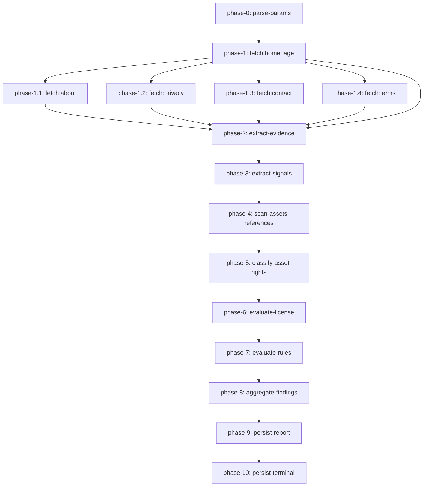

# Scan Workflow Step Reference

> Audience: engineers maintaining the `scan-workflow` Cloudflare Workflow, the
> compliance reviewers who audit its decisions, and the on-call operator
> reading the dashboard graph.
>
> Source of truth: `apps/workers/src/workflows/scan-workflow.ts` and
> `apps/workers/src/workflows/scan-workflow.phases.ts`.
>
> Last reviewed: 2026-08-05.

This document lists every literal-named `step.do(...)` call that the workflow
executes, in the order it runs them. Each entry describes:

- the **purpose** of the step (why it exists),
- the **input** it receives and the **output** it produces,
- the **side effects** it has (DB writes, fetches, log records),
- the **failure modes** that the runner can retry or that bubble up to the
  Workflow runtime, and
- the **SSRF, PII, and citation guardrails** that apply.

The dashboard Graph mirrors the names below. If a step does not appear, the
runner never reached it (the earlier step returned a `failed` terminal state,
or the runtime rolled back because of a non-retryable exception).

## Graph (mermaid)



`phase-0` and `phase-1.x` follow the convention from the
`docs/superpowers/specs/2026-08-04-scan-workflow-step-graph-design.md` spec.

## Step reference

| #   | Name                             | Helper                                    | Net access                  | DB writes        | Retries |
| --- | -------------------------------- | ----------------------------------------- | --------------------------- | ---------------- | ------- |
| 0   | `parse-params`                   | `ScanParamsSchema.parse`                  | none                        | none             | default |
| 1   | `fetch:homepage`                 | `fetchPhase` / `fetchWithRetries`         | bounded HTTP                | none             | 1       |
| 1.1 | `fetch:about`                    | `fetchSinglePagePhase`                    | bounded HTTP                | none             | 1       |
| 1.2 | `fetch:privacy`                  | `fetchSinglePagePhase`                    | bounded HTTP                | none             | 1       |
| 1.3 | `fetch:contact`                  | `fetchSinglePagePhase`                    | bounded HTTP                | none             | 1       |
| 1.4 | `fetch:terms`                    | `fetchSinglePagePhase`                    | bounded HTTP                | none             | 1       |
| 2   | `phase-2:extract-evidence`       | `extractEvidencePhase`                    | none                        | none             | default |
| 3   | `phase-3:extract-signals`        | `extractServiceSignalsPhase`              | none                        | none             | default |
| 4   | `phase-4:scan-assets-references` | `collectAssetReferencesPhase`             | bounded HTTP to stylesheets | none             | default |
| 5   | `phase-5:classify-asset-rights`  | `classifyAssetRightsPhase`                | bounded HTTP per asset      | none             | default |
| 6   | `phase-6:evaluate-license`       | `evaluateLicenseRequirementsPhase`        | registry lookup only        | none             | default |
| 7   | `phase-7:evaluate-rules`         | `evaluatePhase` + `makeWorkflowEvaluator` | optional AI call            | none             | default |
| 8   | `phase-8:aggregate-findings`     | `aggregateFindings`                       | none                        | none             | default |
| 9   | `phase-9:persist-report`         | `persistReportPhase`                      | none                        | `reports` upsert | 5       |
| 10  | `phase-10:persist-terminal`      | `persistTerminalPhase`                    | none                        | `scans` update   | 5       |

`default` = Cloudflare's standard retry policy (Cloudflare retries
transient failures). `5` = the explicit `retries: { limit: 5, delay: "2 seconds",
backoff: "exponential" }` policy used for DB writes.

### Step 0 — `parse-params`

- **Purpose.** Validate the workflow payload against
  `ScanParamsSchema`. The schema enforces required `scanId`, `url` (must parse
  via `new URL`), `jurisdiction`, `category`, `analysisVersion`, and
  optional `requirePages` / `failedPages` / `timeoutPages` enums.
- **Input.** `event.payload` (the JSON body sent by `POST /v1/scans`).
- **Output.** A parsed `ScanWorkflowPayload` typed as `z.infer<typeof
ScanParamsSchema>`.
- **Failure modes.** Throws a `ZodError` if any required field is missing or
  malformed. The runtime does not retry `ZodError`; the instance fails with
  `state: failed` and the dashboard reports a validation error.
- **Guardrails.** `url` must be a valid absolute URL. `jurisdiction` is
  currently restricted to `"VN"` by the public API contract but the workflow
  itself accepts any non-empty string for forward compatibility.

### Step 1 — `fetch:homepage`

- **Purpose.** Fetch the user-submitted URL. If this fails, the scan cannot
  produce a meaningful report, so the workflow returns
  `state: "failed" / status: "needs_review"` and exits.
- **Helper.** `fetchPhase` calls `fetchWithRetries` which performs up to
  `retries: 1` attempts with `backoffMs: 5` between failures. The
  implementation is intentionally synchronous and bounded to keep the
  dashboard latency predictable.
- **SSRF guards.** `fetchBoundedHtml` from `safe-fetch` validates every
  hostname against `validatePublicUrl`, which:
  - rejects `http`/`https`-less protocols and credentials in the URL,
  - resolves A/AAAA via `cloudflare-dns.com` and rejects any answer in the
    loopback, private, link-local, or metadata ranges,
  - caps `redirects ≤ 3`, `decodedBytes ≤ 2_000_000`, `compressedBytes ≤
1_000_000`, and `durationMs ≤ 8_000`.
- **Failure modes.** Network error, SSRF rejection, non-2xx status, or
  response body exceeding the size cap. Any failure surfaces a
  `persistence: failed` step before the workflow returns.
- **Log signature.** `event: "scan.homepage_failed"` with the rejection
  reason. No URL or PII is included in the log payload.

### Steps 1.1 – 1.4 — `fetch:about | fetch:privacy | fetch:contact | fetch:terms`

- **Purpose.** Fetch the secondary pages. The graph inlines four separate
  `step.do` call sites (one per page) so the dashboard shows a distinct node
  per page even if a helper function is shared.
- **Helper.** `fetchSinglePagePhase` accepts a `forcedFailed` and
  `timeoutPages` set; pages listed there short-circuit to
  `{ ok: false, reason: "skipped" }` without any HTTP budget, so the graph
  still shows the node without spending a request.
- **Output.** A `PageResult` (`{ ok: true, pageType, status, html } | { ok:
false, pageType, reason }`) appended to `perPageResults`.
- **Failure modes.** Same SSRF guards as the homepage fetch. A failure
  here is non-fatal; the page is recorded in `coverage.failed` and the
  scan continues as `partial`.
- **Log signature.** `event: "scan.page_fetch_failed"` with
  `pageType` and `reason` only. The `scan.coverage` summary is computed from
  the union of `homepage` and the four page results.

### Step 2 — `phase-2:extract-evidence`

- **Purpose.** Decode each fetched page's bytes into UTF-8 and run the
  deterministic text-evidence extractors (`extractEvidence` from
  `services/evidence`). The extractors pattern-match license numbers, operator
  identity, contact channels, payment context, UGC signals, content model,
  and other structured fields directly from the page text.
- **Helper.** `extractEvidencePhase` reads from a `Map<url, Uint8Array>`
  keyed by the same URL the fetch step used, so the work is O(pages) and
  the dedupe key matches the earlier step exactly.
- **Input.** Fetched page rows (`{ type, url, status }`) and a
  `Map<url, Uint8Array>` of raw HTML.
- **Output.** `EvidenceExtractionResult = { evidence: EvidenceItem[],
pages: { url, html, type }[] }`. The `evidence` array is fed into the
  compliance-core rule engine and the license claims filter.
- **Safety.** All HTML runs through `sanitizePageText` first, which strips
  `<script>`, `<style>`, `<iframe>`, comments, and decodes common
  entities. Prompt-injection patterns are detected (`detectPromptInjection`)
  and any value matching them is dropped. No PII leaves the step.
- **Failure modes.** A page whose status is not 2xx is skipped (no decode
  attempted). A `SanitizationError` from `sanitizePageText` is logged via
  `event: "evidence.extract_failed"` and the page is skipped; the
  workflow continues.

### Step 3 — `phase-3:extract-signals`

- **Purpose.** Detect deterministic service characteristics
  (`login`, `ugc`, `public_profile`, `content_feed`, `follow_or_friend`,
  `comment`, `share`, `editorial_publishing`) on each decoded page. These
  signals drive the strict social-network license gate (UGC + interaction)
  and the editorial publishing cue.
- **Helper.** `extractServiceSignalsPhase` iterates over the pages from
  step 2 and calls `detectServiceSignals({ sourceUrl, html })` per page.
- **Output.** `ServiceSignal[]` with `id`, `kind`, `observed`, `confidence`,
  `sourceUrl`, `excerpt`, `evidenceId`. The `id` is a stable
  `service_signal::${kind}::${fnv1a(sourceUrl)}` hash.
- **Failure modes.** No network access, so this step only fails if a
  pattern evaluator throws on a malformed page. The wrapper iterates with
  `try/catch` and never aborts the scan.

### Step 4 — `phase-4:scan-assets-references`

- **Purpose.** Discover every image, audio, video, and font URL that the
  pages reference. Includes inline `<style>` blocks, `<link rel="stylesheet">`
  references, and CSS `url(...)` declarations.
- **Helper.** `collectAssetReferencesPhase` first runs the pure parser
  `collectAssetReferences` against the decoded page HTML, then issues a
  bounded fetch for each directly referenced external stylesheet via
  `collectStylesheetReferences` (SSRF guard, timeout, max 10 stylesheets
  per page). References are deduplicated by `(kind, url)` and capped at
  `MAX_ASSETS = 50`.
- **Output.** `AssetReference[]` with `{ kind, url, sourceUrl }` where
  `url` is redacted (no query string, no hash).
- **Guardrails.** Each stylesheet fetch goes through
  `fetchBoundedResource` and reuses the same SSRF guards as page fetches.
  Private hosts (loopback, link-local, metadata) are filtered out. The
  `url` field is passed through `redactAssetUrl` to strip query strings
  and fragments before it is returned to subsequent steps.

### Step 5 — `phase-5:classify-asset-rights`

- **Purpose.** Issue one bounded HTTP request per asset reference, compute
  `SHA-256(bytes)` for the response body, and classify the asset by license
  evidence (`open_license_marker`, `explicit_license`, `provider_license`,
  `copyright_notice_only`, `no_license_evidence`, `inaccessible`, or
  `conflicting`).
- **Helper.** `classifyAssetRightsPhase` calls `classifyAssetRights`
  (formerly `collectDigitalAssets`) which contains the per-reference fetch
  loop and the `isFlagged` predicate.
- **Output.** `DigitalAssetCollection` with `assets: DigitalAsset[]`,
  `findings: AssetFinding[]`, and a `summary` `{ total, byKind, flagged }`.
  Each finding is a `digital-rights` report finding with citation
  `vn-ip-law-2022` and the Luật Sở hữu trí tuệ 2022 excerpt.
- **Guardrails.** The body of each asset is hashed; it is never stored.
  URLs are redacted; only the `host` (e.g. `cdn.example.com`) is retained.
  Confidence is set per evidence category; an inaccessible asset gets
  `confidence: 0` and `licenseEvidence: "inaccessible"`.
- **Failure modes.** Each per-asset fetch is wrapped in `try/catch`. A
  failure or oversized response produces an `inaccessible` asset record
  and a high-severity finding; the step never aborts.

### Step 6 — `phase-6:evaluate-license`

- **Purpose.** Translate observed service characteristics and declared
  license claims into a set of `LicenseCheck` records — one per applicable
  license type (online game, electronic press, social network).
- **Helper.** `evaluateLicenseRequirementsPhase` calls
  `evaluateLicenseRequirements` from `@safelaunch/compliance-core`. The
  upstream function applies these gates:
  - `online_game` always fires when the category is `online_game`.
  - `electronic_press` fires when the category is `electronic_press` or the
    page emits an `editorial_publishing` signal.
  - `social_network` fires only when `ugc` is observed **and** at least one
    of `public_profile`, `content_feed`, `follow_or_friend`, `comment`,
    `share` is also observed. Login alone is not enough.
- **Registry adapter.** The InMemoryLicenseRegistry is queried with
  `licenseType: "online_game"` and the `jurisdiction` from the request.
  The current production registry is in-memory; replacing it with
  `vbplLicenseRegistry` will route through `https://vbpl.vn` and require a
  real `licenseNumber` from the operator. The registry has a 5 s timeout
  and never logs PII.
- **Output.** `ReportFinding[]` (one per license check) with
  `domain: "license"` and a `citation` array pointing at the official
  Vietnamese instrument (e.g. `Nghị định 72/2013/NĐ-CP`,
  `Luật Báo chí 2016`, `Luật An toàn thông tin mạng 2015`).
- **Severity policy.** `pass` only when the registry reports
  `verified`; `high` when the registry reports
  `not_found | mismatch | expired | unavailable` or when the requirement
  is activated but the operator did not declare a license number. The
  status is intentionally strict — user-facing copy keeps saying
  "unverified" rather than "violation".

### Step 7 — `phase-7:evaluate-rules`

- **Purpose.** Run the deterministic rubric (`runRules`) across the
  evidence plus the typed findings from steps 5 and 6, then resolve any
  `unknown` outcomes via a bounded RAG call (only when the AI/Vectorize
  bindings are configured and the rule genuinely needs retrieval).
- **Helper.** `evaluatePhase` is called with the existing
  `makeWorkflowEvaluator`; the evaluator now consumes the structured
  `evidence`, `serviceSignals`, `licenseFindings`, and `assetFindings`
  accumulated in the previous steps.
- **Output.** `EvaluateOutcome = { status: ScanTerminalStatus, findings:
ReportFinding[] }`. Findings cover the same shape that the report
  eventually exposes (operator identity, contact channel, license claim,
  asset rights, and any AI-confirmed provision).
- **AI guardrails.** AI evaluation only runs when at least one rule has
  `outcome: "unknown"`; otherwise the run is fully deterministic. The AI
  binding is only consumed if `env.AI` and `env.LEGAL_INDEX` are present
  (configured in `wrangler.jsonc`).
- **Failure modes.** A RAG or AI error falls back to a `review` severity
  finding with the original rule's evidenceIds and a `recommendedAction`
  of "Yêu cầu chuyên gia xem xét thủ công" (request manual review by an
  expert). The step never aborts.

### Step 8 — `phase-8:aggregate-findings`

- **Purpose.** Reduce the per-finding severities to a single
  `ScanTerminalStatus` (`high_risk`, `needs_review`, or
  `no_significant_risk`). The aggregator is reproducible and named in
  `aggregateFindings`; the rubric version is
  `vn-mvp-v2-licensing-digital-rights-strict`.
- **Input.** `findings: ReportFinding[]` plus the `coverage` summary.
- **Output.** `ScanTerminalStatus` used by step 9 and 10 to decide
  whether to persist a report.
- **Aggregation policy.**
  - any current `high` → `high_risk`;
  - any current `review` or partial coverage → `needs_review`;
  - otherwise → `no_significant_risk`;
  - any coverage failure overrides the base result with `needs_review`.
    Upcoming-severity findings never promote the current verdict — they
    appear in the report but do not imply a current violation.

### Step 9 — `phase-9:persist-report`

- **Purpose.** Persist the report payload idempotently in the `reports`
  table. The token is `rpt_<64 hex chars>` derived from
  `SHA-256(scanId)` so it is deterministic across retries.
- **Helper.** `persistReportPhase` upserts on `scan_id` and updates
  `token_hash`, `payload_json`, and `expires_at` (7-day TTL).
- **Output.** `{ token, url }` where `url` is the public report URL on
  `safelaunch.runany.dev/vi/report/{token}`.
- **Retries.** 5 retries with exponential backoff (`delay: "2 seconds"`)
  to absorb D1 cold-start latency and contention.
- **Failure modes.** A non-retryable error (e.g. `FOREIGN KEY constraint`
  when the `scans` row was not inserted) surfaces as a `phase-9:persist-report`
  step error. The retry policy retries transient errors; non-transient
  errors are visible in the dashboard.

### Step 10 — `phase-10:persist-terminal`

- **Purpose.** Persist the terminal scan state in the `scans` table
  (`UPDATE scans SET state = ?, coverage_json = ?`). Runs after the report
  is upserted so the dashboard shows a consistent
  `state: "completed" | "partial" | "failed"` and `coverage` snapshot.
- **Helper.** `persistTerminalPhase`. Retries with the same exponential
  policy as step 9.
- **Failure modes.** Same D1 transient-class errors. The terminal state
  is recoverable from the workflow logs because step 9 already issued a
  report URL.

## End-to-end example

```
POST /v1/scans {"url":"https://example.com","jurisdiction":"VN","category":"online_game","analysisVersion":"vn-mvp-v2-licensing-digital-rights-strict"}
  → 202 Accepted, {"scanId":"scan_…","state":"queued"}

Cloudflare dashboard → Workers → safelaunch-api → Workflows → scan-workflow
  → chọn instance mới nhất → tab Graph
  → 12 node: parse-params → fetch:* → phase-2..phase-10
```

## Test coverage

- `apps/workers/src/workflows/scan-workflow.test.ts` exercises the `runScan`
  orchestrator (deterministic, with fake fetcher).
- `apps/workers/src/workflows/scan-workflow.phases.test.ts` exercises each
  phase helper in isolation.
- `apps/workers/scripts/check-step-graph.mjs` (run via
  `pnpm run check:workflow-graph`) parses the source to confirm all
  `phase-N:*` literals are present and fails the build if a future change
  accidentally collapses one into a closure.

## Update policy

When you add a new `step.do(...)` to the entrypoint:

1. Choose a literal name following the `phase-N:<verb-noun>` convention.
2. Add a `log({ level: "info", event: "phase-N.start" })` at the top of the
   closure to keep the runtime from dead-code-eliminating the step.
3. Wrap the body in `try/catch` so the workflow never hard-aborts on a
   single phase; log the error with `event: "phase-N.fail"` and re-throw
   only if the entire scan is unrecoverable.
4. Update this file (and `workflow-steps.vi.md`) and `check-step-graph.mjs`
   in the same PR.
