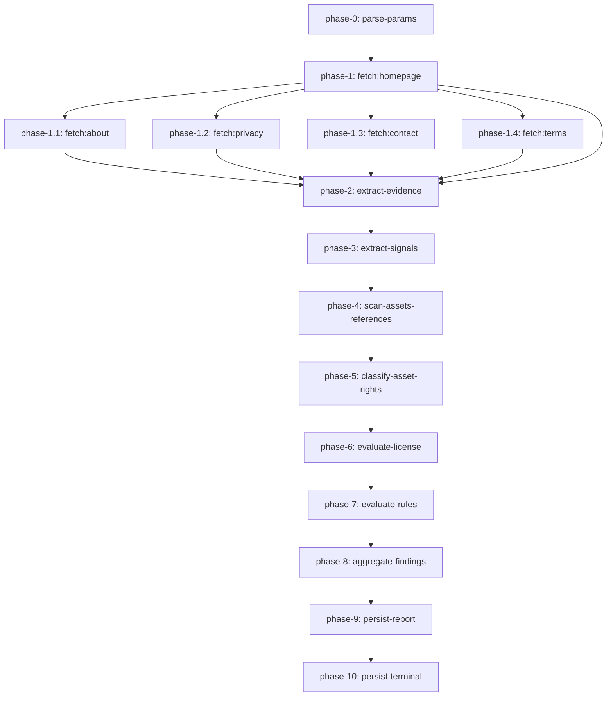

# Tài liệu các step trong scan workflow

> Đối tượng: kỹ sư bảo trì `scan-workflow` (Cloudflare Workflow), người review
> compliance kiểm định quyết định của workflow, và on-call đọc dashboard graph.
>
> Nguồn chính: `apps/workers/src/workflows/scan-workflow.ts` và
> `apps/workers/src/workflows/scan-workflow.phases.ts`.
>
> Review lần cuối: 2026-08-05.

Tài liệu này liệt kê từng lệnh `step.do(...)` literal mà workflow chạy, theo
đúng thứ tự. Mỗi mục mô tả:

- **mục đích** của step (vì sao nó tồn tại),
- **input** nhận vào và **output** trả ra,
- **side effect** (ghi DB, gọi mạng, log),
- **chế độ lỗi** runtime có thể retry hoặc bubble lên Workflow,
- **SSRF, PII, citation guard** áp dụng.

Dashboard Graph vẽ đúng tên các step bên dưới. Nếu một step không xuất hiện,
runtime chưa tới được nó (step trước đó trả về terminal `failed` hoặc runtime
rollback vì exception không retry được).

## Sơ đồ (mermaid)



Quy ước `phase-0` và `phase-1.x` theo spec tại
`docs/superpowers/specs/2026-08-04-scan-workflow-step-graph-design.md`.

## Bảng tham chiếu

| #   | Tên                              | Helper                                    | Truy cập mạng                | Ghi DB           | Retry    |
| --- | -------------------------------- | ----------------------------------------- | ---------------------------- | ---------------- | -------- |
| 0   | `parse-params`                   | `ScanParamsSchema.parse`                  | không                        | không            | mặc định |
| 1   | `fetch:homepage`                 | `fetchPhase` / `fetchWithRetries`         | HTTP bounded                 | không            | 1        |
| 1.1 | `fetch:about`                    | `fetchSinglePagePhase`                    | HTTP bounded                 | không            | 1        |
| 1.2 | `fetch:privacy`                  | `fetchSinglePagePhase`                    | HTTP bounded                 | không            | 1        |
| 1.3 | `fetch:contact`                  | `fetchSinglePagePhase`                    | HTTP bounded                 | không            | 1        |
| 1.4 | `fetch:terms`                    | `fetchSinglePagePhase`                    | HTTP bounded                 | không            | 1        |
| 2   | `phase-2:extract-evidence`       | `extractEvidencePhase`                    | không                        | không            | mặc định |
| 3   | `phase-3:extract-signals`        | `extractServiceSignalsPhase`              | không                        | không            | mặc định |
| 4   | `phase-4:scan-assets-references` | `collectAssetReferencesPhase`             | HTTP bounded tới stylesheet  | không            | mặc định |
| 5   | `phase-5:classify-asset-rights`  | `classifyAssetRightsPhase`                | HTTP bounded theo từng asset | không            | mặc định |
| 6   | `phase-6:evaluate-license`       | `evaluateLicenseRequirementsPhase`        | chỉ registry lookup          | không            | mặc định |
| 7   | `phase-7:evaluate-rules`         | `evaluatePhase` + `makeWorkflowEvaluator` | có thể gọi AI                | không            | mặc định |
| 8   | `phase-8:aggregate-findings`     | `aggregateFindings`                       | không                        | không            | mặc định |
| 9   | `phase-9:persist-report`         | `persistReportPhase`                      | không                        | upsert `reports` | 5        |
| 10  | `phase-10:persist-terminal`      | `persistTerminalPhase`                    | không                        | update `scans`   | 5        |

`mặc định` = Cloudflare retry transient theo policy mặc định. `5` =
`retries: { limit: 5, delay: "2 seconds", backoff: "exponential" }` — policy
riêng cho các lệnh ghi D1.

### Step 0 — `parse-params`

- **Mục đích.** Validate payload workflow với `ScanParamsSchema`. Schema bắt
  buộc các trường `scanId`, `url` (phải parse qua `new URL`),
  `jurisdiction`, `category`, `analysisVersion`, và optional
  `requirePages` / `failedPages` / `timeoutPages` enum.
- **Input.** `event.payload` (JSON body từ `POST /v1/scans`).
- **Output.** `ScanWorkflowPayload` đã được parse, type theo
  `z.infer<typeof ScanParamsSchema>`.
- **Lỗi.** Throw `ZodError` nếu field thiếu hoặc sai. Runtime không retry
  `ZodError`; instance fail với `state: failed`.
- **Guard.** `url` phải là URL tuyệt đối hợp lệ. `jurisdiction` hiện được
  API công khai giới hạn ở `"VN"` nhưng workflow chấp nhận mọi chuỗi khác
  rỗng để không phá future jurisdiction.

### Step 1 — `fetch:homepage`

- **Mục đích.** Tải URL người dùng gửi. Nếu fetch thất bại, scan không tạo
  được report có ý nghĩa, workflow trả về `state: "failed" /
status: "needs_review"` và dừng.
- **Helper.** `fetchPhase` gọi `fetchWithRetries` với `retries: 1` và
  `backoffMs: 5`. Implementation đồng bộ và có giới hạn để giữ latency
  dashboard ổn định.
- **SSRF guard.** `fetchBoundedHtml` từ `safe-fetch` validate mọi hostname
  qua `validatePublicUrl`:
  - từ chối protocol không phải `http`/`https` và URL có credentials;
  - resolve A/AAAA qua `cloudflare-dns.com` và từ chối mọi IP loopback,
    private, link-local, metadata;
  - giới hạn `redirects ≤ 3`, `decodedBytes ≤ 2_000_000`, `compressedBytes
≤ 1_000_000`, `durationMs ≤ 8_000`.
- **Lỗi.** Network error, SSRF rejection, non-2xx, body vượt size cap. Bất
  kỳ lỗi nào đều khiến workflow chạy `persist-terminal` rồi trả về
  `failed`.
- **Log.** `event: "scan.homepage_failed"` với reason; không log URL hay PII.

### Steps 1.1 – 1.4 — `fetch:about | fetch:privacy | fetch:contact | fetch:terms`

- **Mục đích.** Tải các trang phụ. Graph inlines 4 call site `step.do` riêng
  biệt (một cho mỗi page) để dashboard hiển thị từng node dù helper là
  chung.
- **Helper.** `fetchSinglePagePhase` nhận `forcedFailed` và `timeoutPages`;
  page nằm trong set đó short-circuit về `{ ok: false, reason: "skipped" }`
  mà không tốn HTTP, đảm bảo graph vẫn hiển thị node.
- **Output.** `PageResult` (`{ ok: true, pageType, status, html } | { ok:
false, pageType, reason }`) thêm vào `perPageResults`.
- **Lỗi.** Cùng SSRF guard với homepage. Lỗi ở đây không fatal; page được
  ghi vào `coverage.failed`, scan tiếp tục với `partial`.
- **Log.** `event: "scan.page_fetch_failed"` chỉ với `pageType` và
  `reason`. Tóm tắt `coverage` tính từ union của homepage và 4 page
  result.

### Step 2 — `phase-2:extract-evidence`

- **Mục đích.** Decode byte của mỗi page đã fetch sang UTF-8 và chạy các
  extractor văn bản tất định (`extractEvidence` từ `services/evidence`).
  Extractor dùng pattern match để tìm số giấy phép, thông tin đơn vị vận
  hành, kênh liên hệ, ngữ cảnh thanh toán, tín hiệu UGC, mô hình nội dung
  và các trường có cấu trúc khác trực tiếp từ văn bản.
- **Helper.** `extractEvidencePhase` đọc từ `Map<url, Uint8Array>` key theo
  đúng URL mà fetch step dùng, đảm bảo dedupe key trùng khớp.
- **Input.** Row page đã fetch (`{ type, url, status }`) và map `Map<url,
Uint8Array>` chứa raw HTML.
- **Output.** `EvidenceExtractionResult = { evidence: EvidenceItem[],
pages: { url, html, type }[] }`. Mảng `evidence` được rule engine của
  compliance-core và bộ lọc license claims sử dụng.
- **Safety.** Mọi HTML chạy qua `sanitizePageText` trước, bỏ `<script>`,
  `<style>`, `<iframe>`, comment, decode entity thường gặp. Mẫu
  prompt-injection được phát hiện (`detectPromptInjection`); mọi value
  trùng pattern bị bỏ. Không PII rời khỏi step.
- **Lỗi.** Page có status không phải 2xx được bỏ qua. `SanitizationError`
  từ `sanitizePageText` được log `event: "evidence.extract_failed"`; workflow
  tiếp tục.

### Step 3 — `phase-3:extract-signals`

- **Mục đích.** Phát hiện đặc tính dịch vụ tất định (`login`, `ugc`,
  `public_profile`, `content_feed`, `follow_or_friend`, `comment`, `share`,
  `editorial_publishing`) trên từng page đã decode. Các signal này điều
  khiển cổng giấy phép mạng xã hội (UGC + interaction) và tín hiệu xuất
  bản biên tập.
- **Helper.** `extractServiceSignalsPhase` lặp qua page từ step 2 và gọi
  `detectServiceSignals({ sourceUrl, html })` mỗi page.
- **Output.** `ServiceSignal[]` với `id`, `kind`, `observed`, `confidence`,
  `sourceUrl`, `excerpt`, `evidenceId`. `id` ổn định
  `service_signal::${kind}::${fnv1a(sourceUrl)}`.
- **Lỗi.** Không có truy cập mạng. Chỉ fail nếu evaluator throw trên page
  lỗi. Wrapper có `try/catch`, không bao giờ abort scan.

### Step 4 — `phase-4:scan-assets-references`

- **Mục đích.** Khám phá mọi URL ảnh, audio, video, font mà các page tham
  chiếu. Bao gồm `<style>` inline, `<link rel="stylesheet">` và khai
  báo `url(...)` trong CSS.
- **Helper.** `collectAssetReferencesPhase` đầu tiên chạy parser thuần
  `collectAssetReferences` với HTML page đã decode, sau đó gọi bounded
  fetch cho mỗi stylesheet ngoài tham chiếu trực tiếp qua
  `collectStylesheetReferences` (SSRF guard, timeout, tối đa 10 stylesheet
  mỗi page). Reference được dedupe theo `(kind, url)` và giới hạn ở
  `MAX_ASSETS = 50`.
- **Output.** `AssetReference[]` với `{ kind, url, sourceUrl }`. `url` đã
  được redact (bỏ query string, fragment).
- **Guard.** Mỗi stylesheet fetch đi qua `fetchBoundedResource` và dùng
  chung SSRF guard với page fetch. Private host (loopback, link-local,
  metadata) bị filter. `url` chạy qua `redactAssetUrl` trước khi xuất
  cho step sau.

### Step 5 — `phase-5:classify-asset-rights`

- **Mục đích.** Gửi một bounded HTTP request cho mỗi asset reference,
  tính `SHA-256(bytes)` của response body, phân loại license evidence
  (`open_license_marker`, `explicit_license`, `provider_license`,
  `copyright_notice_only`, `no_license_evidence`, `inaccessible`,
  `conflicting`).
- **Helper.** `classifyAssetRightsPhase` gọi `classifyAssetRights` (trước
  là `collectDigitalAssets`) chứa vòng fetch per-reference và predicate
  `isFlagged`.
- **Output.** `DigitalAssetCollection` với `assets: DigitalAsset[]`,
  `findings: AssetFinding[]`, và `summary` `{ total, byKind, flagged }`.
  Mỗi finding là `digital-rights` report finding với citation
  `vn-ip-law-2022` và trích dẫn Luật Sở hữu trí tuệ 2022.
- **Guard.** Body mỗi asset chỉ được hash; không lưu. URL được redact; chỉ
  giữ `host` (vd. `cdn.example.com`). Confidence đặt theo evidence
  category; asset không truy cập được có `confidence: 0` và
  `licenseEvidence: "inaccessible"`.
- **Lỗi.** Mỗi per-asset fetch có `try/catch`. Lỗi hoặc response quá lớn
  tạo asset record `inaccessible` và finding high; step không bao giờ
  abort.

### Step 6 — `phase-6:evaluate-license`

- **Mục đích.** Dịch đặc tính dịch vụ quan sát được và license claim đã
  khai báo thành tập `LicenseCheck` — một record cho mỗi loại giấy phép
  áp dụng (trò chơi điện tử, báo chí điện tử, mạng xã hội).
- **Helper.** `evaluateLicenseRequirementsPhase` gọi
  `evaluateLicenseRequirements` từ `@safelaunch/compliance-core`. Hàm áp
  dụng các cổng:
  - `online_game` luôn bật khi category là `online_game`.
  - `electronic_press` bật khi category là `electronic_press` hoặc page
    phát ra signal `editorial_publishing`.
  - `social_network` bật khi quan sát thấy ít nhất **hai** tín hiệu cộng
    đồng/chia sẻ khác nhau (không tính `login`): `public_profile` (tạo
    trang cá nhân), `ugc` (tự đăng tải nội dung), `follow_or_friend` /
    `comment` / `share` (tương tác đa chiều), hoặc `content_feed`
    (diễn đàn/hội nhóm). Logic này bám sát 4 tiêu chí phân biệt mạng xã
    hội tại Nghị định 27/2018/NĐ-CP sửa đổi Nghị định 72/2013/NĐ-CP. Đăng
    nhập/đăng ký là tính năng kỹ thuật để định danh — không đủ một mình.
- **Registry adapter.** InMemoryLicenseRegistry được query với
  `licenseType: "online_game"` và `jurisdiction` từ request. Production
  hiện dùng in-memory; thay bằng `vbplLicenseRegistry` sẽ route qua
  `https://vbpl.vn` và yêu cầu `licenseNumber` thực từ chủ thể. Registry
  có timeout 5s, không log PII.
- **Output.** `ReportFinding[]` (một cho mỗi license check) với
  `domain: "license"` và mảng `citation` trỏ tới văn bản pháp luật Việt
  Nam hiện hành (vd. Nghị định 72/2013/NĐ-CP, Nghị định 27/2018/NĐ-CP
  sửa đổi Nghị định 72/2013/NĐ-CP cho mạng xã hội, Luật Báo chí 2016).
- **Severity policy.** `pass` chỉ khi registry báo `verified`; `high`
  khi registry báo `not_found | mismatch | expired | unavailable` hoặc khi
  yêu cầu được kích hoạt mà chủ thể chưa khai báo số giấy phép. Trạng
  thái cố ý strict — copy hướng người dùng vẫn nói "chưa xác minh" thay
  vì "vi phạm".

### Step 7 — `phase-7:evaluate-rules`

- **Mục đích.** Chạy rubric tất định (`runRules`) trên evidence cộng với
  typed finding từ step 5 và 6, rồi giải quyết mọi `unknown` outcome qua
  bounded RAG call (chỉ khi binding AI/Vectorize được cấu hình và rule
  thực sự cần retrieval).
- **Helper.** `evaluatePhase` được gọi với `makeWorkflowEvaluator` hiện
  có; evaluator giờ tiêu thụ `evidence`, `serviceSignals`,
  `licenseFindings`, `assetFindings` từ các step trước.
- **Output.** `EvaluateOutcome = { status: ScanTerminalStatus, findings:
ReportFinding[] }`. Finding dùng cùng shape mà report cuối sẽ expose
  (operator identity, contact channel, license claim, asset rights, và mọi
  AI-confirmed provision).
- **AI guard.** AI evaluation chỉ chạy khi có ít nhất một rule
  `outcome: "unknown"`; ngược lại hoàn toàn tất định. AI binding chỉ được
  dùng nếu `env.AI` và `env.LEGAL_INDEX` hiện diện (cấu hình trong
  `wrangler.jsonc`).
- **Lỗi.** RAG/AI error fallback thành finding severity `review` với
  `evidenceIds` gốc và `recommendedAction` "Yêu cầu chuyên gia xem xét
  thủ công". Step không bao giờ abort.

### Step 8 — `phase-8:aggregate-findings`

- **Mục đích.** Rút gọn severity per-finding thành một
  `ScanTerminalStatus` duy nhất (`high_risk`, `needs_review`, hoặc
  `no_significant_risk`). Aggregator ở `aggregateFindings` có thể tái
  tạo; rubric version là `vn-mvp-v2-licensing-digital-rights-strict`.
- **Input.** `findings: ReportFinding[]` và `coverage` summary.
- **Output.** `ScanTerminalStatus` dùng cho step 9 và 10.
- **Chính sách gộp.**
  - có bất kỳ current `high` → `high_risk`;
  - có bất kỳ current `review` hoặc partial coverage → `needs_review`;
  - ngược lại → `no_significant_risk`;
  - coverage fail nào đè kết quả base bằng `needs_review`.
    Upcoming-severity finding không bao giờ thăng verdict hiện tại — chúng
    hiển thị trong report nhưng không ngụ ý vi phạm hiện hành.

### Step 9 — `phase-9:persist-report`

- **Mục đích.** Lưu report payload idempotent vào bảng `reports`. Token
  là `rpt_<64 hex chars>` derived từ `SHA-256(scanId)` nên deterministic
  qua các lần retry.
- **Helper.** `persistReportPhase` upsert theo `scan_id`, cập nhật
  `token_hash`, `payload_json`, `expires_at` (TTL 7 ngày).
- **Output.** `{ token, url }` với `url` là link report công khai trên
  `safelaunch.runany.dev/vi/report/{token}`.
- **Retry.** 5 lần với exponential backoff (`delay: "2 seconds"`) để hấp
  thụ latency cold-start và contention của D1.
- **Lỗi.** Lỗi non-retry (vd. `FOREIGN KEY constraint` khi `scans` row
  chưa insert) hiện ra ở step `phase-9:persist-report`. Policy retry cho
  transient; non-transient hiển thị trên dashboard.

### Step 10 — `phase-10:persist-terminal`

- **Mục đích.** Lưu terminal scan state trong bảng `scans` (`UPDATE scans
SET state = ?, coverage_json = ?`). Chạy sau khi report đã upsert để
  dashboard hiển thị nhất quán `state: "completed" | "partial" |
"failed"` cùng `coverage` snapshot.
- **Helper.** `persistTerminalPhase`. Retry cùng policy exponential như
  step 9.
- **Lỗi.** Cùng class D1 transient. Terminal state có thể phục hồi từ
  workflow log vì step 9 đã cấp report URL.

## Ví dụ end-to-end

```
POST /v1/scans {"url":"https://example.com","jurisdiction":"VN","category":"online_game","analysisVersion":"vn-mvp-v2-licensing-digital-rights-strict"}
  → 202 Accepted, {"scanId":"scan_…","state":"queued"}

Cloudflare dashboard → Workers → safelaunch-api → Workflows → scan-workflow
  → chọn instance mới nhất → tab Graph
  → 12 node: parse-params → fetch:* → phase-2..phase-10
```

## Phạm vi test

- `apps/workers/src/workflows/scan-workflow.test.ts` exercise orchestrator
  `runScan` (deterministic, dùng fake fetcher).
- `apps/workers/src/workflows/scan-workflow.phases.test.ts` exercise từng
  phase helper trong isolation.
- `apps/workers/scripts/check-step-graph.mjs` (chạy qua `pnpm run
check:workflow-graph`) parse source để xác nhận mọi literal
  `phase-N:*` đều có mặt; fail build nếu thay đổi trong tương lai vô
  tình collapse một step vào closure.

## Quy tắc cập nhật

Khi thêm `step.do(...)` mới vào entrypoint:

1. Chọn tên literal theo convention `phase-N:<động-từ-danh-từ>`.
2. Thêm `log({ level: "info", event: "phase-N.start" })` ở đầu closure
   để runtime không dead-code-eliminate step.
3. Bọc body trong `try/catch` để workflow không hard-abort khi một phase
   lỗi; log error với `event: "phase-N.fail"` và chỉ throw lại nếu cả
   scan không thể phục hồi.
4. Cập nhật file này (và `workflow-steps.en.md`) và `check-step-graph.mjs`
   trong cùng PR.
